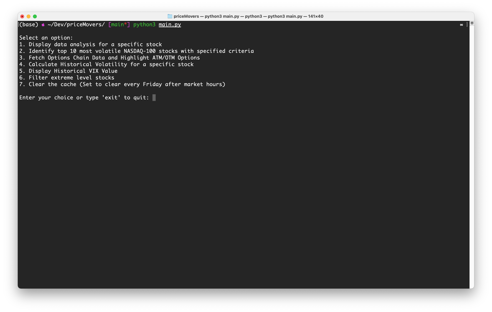

# Stock Analysis Tool

## Description

This project is a command-line interface (CLI) tool designed for stock market analysis. It provides users with various options to analyze stock data, including historical volatility, Bollinger Bands, RSI levels, and options data for individual stocks and the NASDAQ-100 index. The tool aims to help users identify potential trading opportunities by analyzing stocks at extreme levels and understanding market sentiment through the VIX.

## Features

The tool offers the following options for stock market analysis:

1. **Display Data Analysis for a Specific Stock**: Enter the ticker symbol to receive fundamental and technical analysis including PE Ratio, EPS, Profit Margins, and more.

2. **Identify Top 10 Most Volatile NASDAQ-100 Stocks**: Specify criteria such as minimum dollar movement and maximum stock price to filter the top 10 volatile stocks in the NASDAQ-100.

3. **Fetch Options Chain Data and Highlight ATM/OTM Options**: For a given stock symbol, fetch the options chain data and highlight At-The-Money (ATM) and Out-Of-The-Money (OTM) options.

4. **Calculate Historical Volatility for a Specific Stock**: Enter a stock ticker to calculate its historical volatility over the past year.

5. **Display Historical VIX Value**: Shows the historical VIX value to gauge market volatility expectations.

6. **Filter and Display Top Extreme Level Stocks**: Identifies and displays the top 10 stocks that are at the Bollinger Band upper band with an RSI at or above 70, or at the lower band with an RSI at or below 30.




## Note on Data Handling

At the current stage, the project requires manually importing a CSV file (`stocks-screener-02-29-2024.csv`) containing stock data.

I recognize the importance of having the most up-to-date data for stock analysis and are working on integrating direct data fetching from financial APIs in future updates. This enhancement will automate data retrieval, ensuring users always have access to the latest stock market information without manual steps.

If you wish to use the most current data before this feature is implemented, you will need to manually update the CSV file with recent data from your preferred financial data source.

## Installation and Usage

```bash
git clone https://github.com/0xjcf/nasdaq_100_stock_analysis.git
cd nasdaq_100_stock_analysis
pip install -r requirements.txt
python main.py
